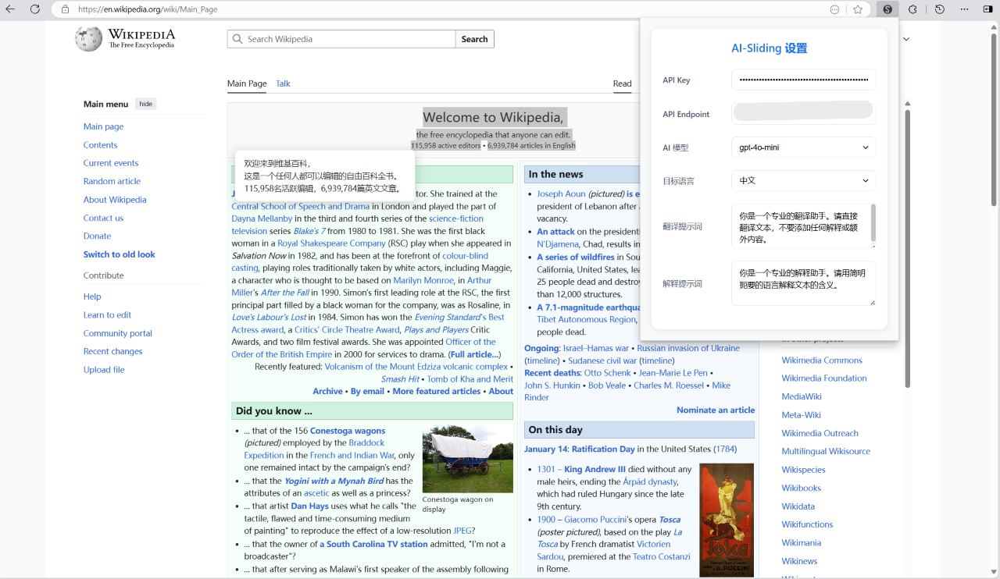

# AI-Sliding 智能浏览器滑动助手

AI-Sliding 是一个基于大语言模型的 Chrome 浏览器扩展，提供自定义的智能划词翻译和解释功能，让您的网页浏览体验更加便捷。



## 主要功能

- 🚀 智能划词翻译：选中任意文本即可快速翻译
- 📚 上下文解释：针对专业术语或复杂概念提供详细解释
- 🎯 多语言支持：支持中文、英语、日语等多种语言互译
- ⚙️ 高度可定制：支持自定义 API、模型和提示词
- 🎨 优雅界面：简洁美观的用户界面，支持暗色模式
- 🔒 隐私保护：本地处理所有数据，不保存任何用户信息

## 安装使用

1. 从 Chrome 网上应用店安装扩展
2. 点击扩展图标，在设置页面配置 OpenAI API 密钥
3. 选择目标语言和其他偏好设置
4. 在任意网页上选中文本，即可看到翻译/解释选项

## 配置说明

### API 设置

- API Key：您的 OpenAI API 密钥
- API Endpoint：API 服务器地址，默认为 OpenAI 官方接口
- 模型选择：支持 gpt-4o-mini、gpt-4o 等多个模型，也可自定义模型

### 语言设置

- 目标语言：支持中文、英语、日语、韩语、法语、德语、西班牙语、俄语等
- 翻译提示词：自定义翻译时的系统提示
- 解释提示词：自定义解释时的系统提示

## 技术实现

- 使用 Chrome Extension Manifest V3 开发
- 基于 OpenAI API 实现智能翻译和解释
- 采用原生 JavaScript 实现，无需额外依赖
- 使用 CSS Grid 和 Flexbox 实现响应式布局

## 隐私声明

本扩展：

- 不会收集任何用户数据
- 所有 API 请求直接与 OpenAI 服务器通信
- API 密钥仅保存在本地浏览器中
- 不会追踪用户的浏览行为

## 开发说明

### 项目结构

```txt
chrome-extension-crx/
├── manifest.json // 扩展配置文件
├── content.js // 内容脚本
├── content.css // 样式文件
├── popup.html // 设置页面
├── popup.js // 设置逻辑
├── popup.css // 设置页面样式
└── images/ // 图标资源
```

### 本地开发

1. 克隆仓库
2. 在 Chrome 扩展管理页面开启开发者模式
3. 点击"加载已解压的扩展程序"
4. 选择项目目录即可

## 贡献指南

欢迎提交 Issue 和 Pull Request。在提交代码前，请确保：

- 遵循现有的代码风格
- 添加必要的注释
- 更新相关文档
- 测试所有功能正常

## 许可证

MIT License

## 联系方式

如有问题或建议，欢迎通过以下方式联系：

- 提交 Issue
- 发送邮件至[youngzm339@outlook.com]
